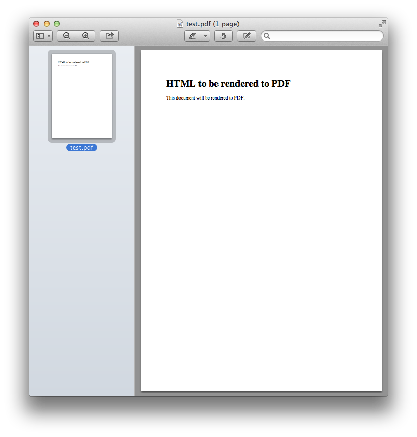

HTML to PDF rendering server
============================

.. image:: https://img.shields.io/pypi/v/html2pdf-server.svg
   :target: https://pypi.python.org/pypi/html2pdf-server

.. image:: https://img.shields.io/docker/automated/spoqa/html2pdf-server.svg
   :target: https://hub.docker.com/r/spoqa/html2pdf-server/

The name says it all.  You request a ``POST`` with an HTML, and then you
will get the response with the rendered PDF.

HTTP API
--------

Send ``POST /`` request with ``Content-Type: text/html`` e.g.:

.. code-block:: http

   POST / HTTP/1.1
   Content-Type: text/html; charset=utf-8
   Accept: application/pdf

   <!DOCTYPE>
   <html>
   <body>
     <h1>HTML to be rendered to PDF</h1>
     
This document will be rendered to PDF.

   </body>
   </html>

(Note that you have to set ``Accept: application/pdf`` header.)

And then you will get a PDF document through its response e.g.:

.. code-block:: http

   HTTP/1.1 200 OK
   Content-Type: application/pdf
   Server: html2pdf-server

   (...omitted...)

Available mime types
''''''''''''''''''''

You can set ``Accept`` header to various mime types.

application/pdf
  respond a PDF document.  this type is the default type.

image/png
  respond a PNG image.

image/jpeg
  respond a JPEG image.

Session in ``curl``
-------------------

.. code-block:: console

   $ cat input.html
   <!DOCTYPE>
   <html>
   <body>
     <h1>HTML to be rendered to PDF</h1>
     
This document will be rendered to PDF.

   </body>
   </html>
   $ curl --header 'Content-Type: text/html' \
          --data "`cat input.html`" \
          --output output.pdf \
          http://localhost:8080/
   $ open output.pdf  # Use xdg-open on Linux

Result screenshot:

Getting started using Docker
----------------------------

Due to its non-Python dependencies the easist way to use this is using Docker.
The official Docker image exposes 8080 port for HTTP server.

.. code-block:: console

   $ docker run -p 8080:8080 spoqa/html2pdf-server

If you need a pong endpoint for health check specify ``PONG_PATH`` environment
variable:

.. code-block:: console

   $ docker run -e PONG_PATH=/ping/ -p 8080:8080 spoqa/html2pdf-server

Getting started without Docker
------------------------------

Installation
''''''''''''

You can install it using ``pip``:

.. code-block:: console

   $ pip install --user git+git://github.com/spoqa/html2pdf-server.git

Note that WeasyPrint_ has several dependencies that need to be installed
using system package managers e.g. APT, Homebrew.  `Read the docs.`__

.. _WeasyPrint: http://weasyprint.org/
__ http://weasyprint.org/docs/install/#by-platform

Running server
''''''''''''''

Use ``html2pdfd`` command:

.. code-block:: console

   $ html2pdfd --port 8080
   serving on http://0.0.0.0:8080

Or you can use your preferred WSGI server as well (WSGI endpoint is
``html2pdfd:app``):

.. code-block:: console

   $ waitress-serve --port=8080 html2pdfd:app
   serving on http://0.0.0.0:8080

License
-------

Distributed under AGPLv3_ or later.

.. _AGPLv3: https://www.gnu.org/licenses/agpl-3.0.html

Changelog
---------

Version 1.1.0
'''''''''''''

Released on January 26, 2017.

- Added an option to enable pong endpoint for health check.

  - ``PONG_PATH`` environment variable for Docker.
  - ``--pong-path`` option for CLI.

- Fixed a bug that ``--help`` option crashed while it's trying to render
  default values.

Version 1.0.0
'''''''''''''

Initial release.  Released on January 25, 2017.
